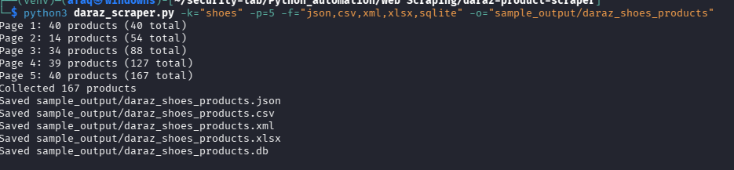

# Daraz Product Scraper

A command-line tool that collects product data from [Daraz.pk](https://www.daraz.pk) search results and exports it to CSV, JSON, Excel, XML or SQLite.

It uses **Playwright** to load the page like a real browser (Daraz fills in product data with JavaScript) and **BeautifulSoup** to parse it. All CSS selectors live in a config file, so if Daraz changes its layout you can update one file instead of the code.




_Add a screenshot of a run or of the output file here._

---

## Features

- Search by any keyword
- Scrape a set number of pages or `all` (stops automatically when there are no more new products)
- Extracts title, price, discount, units sold, image URL and product link
- Cleans values into numbers (`Rs. 9,500` becomes `9500.0`, `1.2K sold` becomes `1200`)
- Removes duplicate products
- Exports to **CSV, JSON, Excel (.xlsx), XML and SQLite**
- Selectors stored in `selectors.ini`, with no code changes needed when the site changes
- Random delays between pages, lazy-image loading and clear error messages

## Requirements

- Python 3.10 or newer
- Packages: `playwright`, `beautifulsoup4`, `pandas`, `openpyxl`

## Installation

```bash
git clone https://github.com/<your-username>/daraz-product-scraper.git
cd daraz-product-scraper

python3 -m venv venv
source venv/bin/activate          # Windows: venv\Scripts\activate

pip install -r requirements.txt
playwright install chromium
```

`requirements.txt`:

```
playwright
beautifulsoup4
pandas
openpyxl
```

## Usage

```bash
python3 daraz_scraper.py -k "laptops" -p 3
```

| Option | Description | Default |
|---|---|---|
| `-k`, `--keyword` | Product to search for (required) | none |
| `-p`, `--page` | Number of pages, or `all` (max 50) | `all` |
| `-o`, `--output` | Output path without extension, e.g. `Output/laptops` | `daraz_products` |
| `-f`, `--format` | Comma-separated: `csv,json,xlsx,xml,sqlite` | `json,csv` |
| `-c`, `--config` | Path to the selectors config file | `selectors.ini` |

Missing folders in the output path (like `Output/`) are created automatically.

### Examples

```bash
# First 3 pages, saved as JSON and CSV
python3 daraz_scraper.py -k "laptops" -p 3

# All pages, saved to Output/ram in Excel and SQLite
python3 daraz_scraper.py -k "ram" -p all -o Output/ram -f xlsx,sqlite

# Multi-word keyword, JSON and XML
python3 daraz_scraper.py -k "gaming mouse" -p 2 -f json,xml
```

## Output

Each product is one record with the same fields:

| Field | Description |
|---|---|
| `title` | Product name |
| `price` | Price as a number |
| `discount_percent` | Discount percentage (`0` if none) |
| `sold` | Units sold as a number (`0` if not shown) |
| `image` | Product image URL |
| `url` | Product page link |
| `keyword` | Search term used |
| `scraped_at` | Date and time of collection |

Sample JSON record:

```json
{
  "title": "Example Laptop 15.6 inch 8GB RAM 256GB SSD",
  "price": 89999.0,
  "discount_percent": 12,
  "sold": 340,
  "image": "https://example.com/image.jpg",
  "url": "https://www.daraz.pk/products/example-i123456.html",
  "keyword": "laptops",
  "scraped_at": "2026-10-07T14:30:00"
}
```

Sample files are in the [`sample_output/`](sample_output) folder.

## Configuration (`selectors.ini`)

```ini
[daraz]
base_url = https://www.daraz.pk/catalog/?q={keyword}&page={page}
wait_selector = [data-qa-locator='product-item']
card = div.Bm3ON
title = div.RfADt a
price = span.ooOxS
discount = span.IcOsH
sold = span._1cEkb
image = img
```

- Values are standard CSS selectors.
- `{keyword}` and `{page}` in `base_url` are filled in by the script.
- `discount`, `sold` and `image` are optional. Leave them blank to skip them.

### If the output suddenly comes back empty

Daraz uses auto-generated class names (like `Bm3ON`), and they change when the site is redeployed.

1. Open a Daraz search page in your browser.
2. Right-click a product card and choose **Inspect**.
3. Find the new class names for the card, title, price, discount and sold elements.
4. Update them in `selectors.ini`. No code changes are needed.

## How it works

1. Builds the search URL for each page from `base_url`.
2. Opens it in headless Chromium and waits for the product cards to appear.
3. Scrolls down so lazy-loaded images get their real URLs.
4. Parses each card with BeautifulSoup, cleans the values and skips duplicates.
5. Stops when the page limit is reached or a page adds no new products.
6. Saves the results in the requested formats.

## Limitations

- Built and tested for **Daraz.pk only**. Sites with strong bot protection (such as Amazon and eBay) block automated browsers, so they are not supported. For those, use the official APIs.
- Selectors can break when Daraz changes its page structure (see the section above).
- Only data from the search results pages is collected. Descriptions, ratings and reviews on product detail pages are not included yet.
- Daraz may show a captcha or rate-limit you if you scrape too fast or too often. Keep the page counts reasonable.

## Roadmap

- [ ] Ratings and review counts
- [ ] Product description and extra images from detail pages
- [ ] Optional image embedding in Excel
- [ ] Simple web interface (Streamlit)

## Legal and ethical note

This project is for educational and demonstration purposes. Before scraping any website, check its terms of service and `robots.txt`, collect only publicly available data, keep request rates low, and do not overload the site's servers. You are responsible for how you use this tool.

## Author

**Your Name**: [GitHub](https://github.com/<your-username>) | [Freelancer profile](https://www.freelancer.com/u/<your-username>)

## License

MIT License (add a `LICENSE` file if you want to publish under it).
